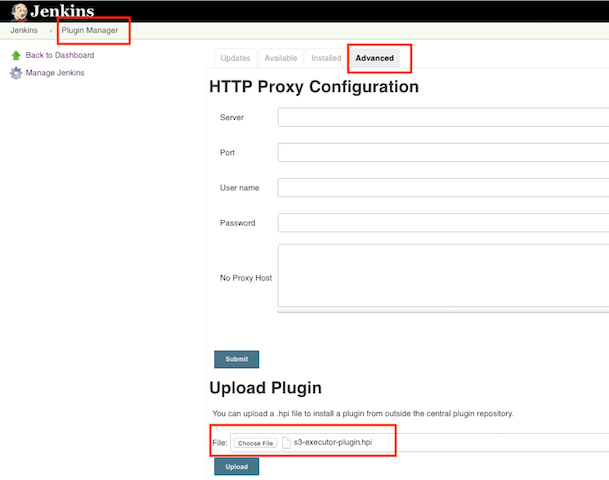
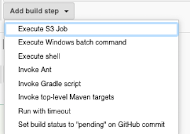
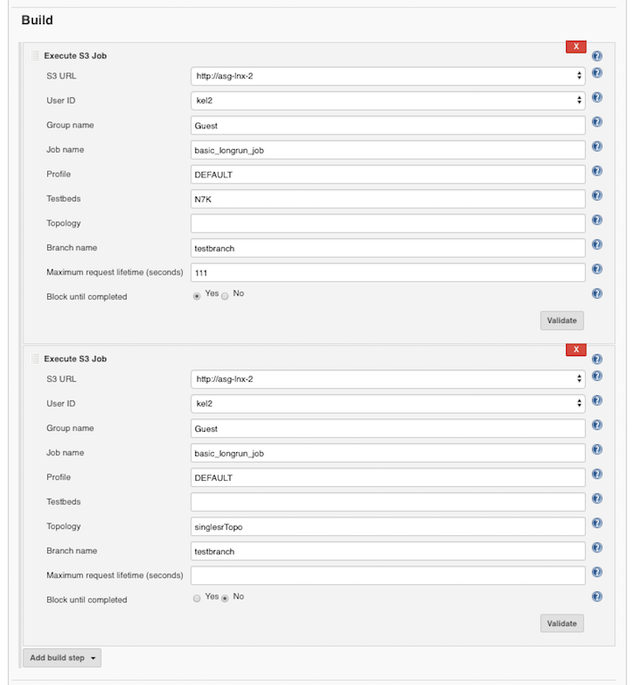
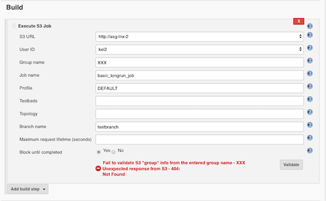
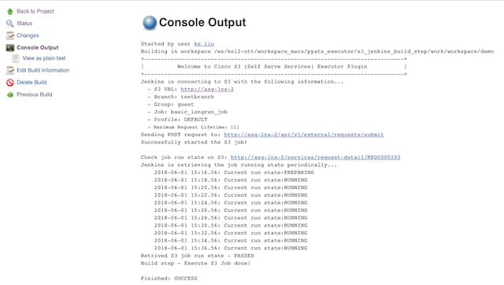

# S3 Executor Plugin User Guide 

The S3 (Self Serve Services) Executor Plugin enables sanity job(s) registered in S3 portal(s) to be called within a build step.

## Objectives

The objective of this doc is to show how to:

* Install S3 Executor Plugin 
* Configure S3 Executor plugin  
* Register and validate S3 instance(s) 
* Add Execute S3 build step to the pipeline calling jobs in registered S3 Portal(s)  
* Execute and View results 

## Prerequisites

* Jenkins installation - version 2.54 or later
* Java 8

## Plugin Installation

### Step 1:
Download the plugin (HPI) file from:

### Step 2:
Log in to Jenkins, click on "Manage Jenkins" and choose "Manage Plugins" from the list.

### Step 3:
From the "Manage Plugins" select the "Advanced" tab.  In "Upload Plugin" section choose the _.hpi_ file downloaded in step #1, and click on "upload".  Follow through the steps prompted by Jenkin to complete the installation.  This restart of Jenkins is optional, and not required for this plugin.   

## Plugin Configuration

### System Configuration
To call S3 jobs as part of the build step workflow, the S3 instances details needs to be registered and validated.  Follow the steps below to register the S3 instance(s), and to validated its interface with Jenkins.      

#### Step 1:
Navigate to "Manage Jenkins" and choose "Configure System"

#### Step 2:
In __Self Serve Services (S3) Servers Registration__ section click the "Add" button.

#### Step 3:
Register the S3 Instance, the user id, and the user's REST API Authentication Token in Jenkins. The Executor Plugin uses the token-based authorization mechanism to verify the S3 Instances.  The information can be found in the given S3 instance -> user profile -> Token UI. 

`Note:  "Token" is the value of the token only, exclude any prefix (ie: Jwt).`
 

#### Step 4:
Validate the interface between Jenkins to the configured S3 Instance. Once required information is completed,  click the "validate" button.

Possible validation messages are:
* Successful validation: `OK`
* Missing required info: `Required: host name, port, user name and token.`
* Wrong format: Error: `Invalid token format. Remove the token frefix: Jwt`
* Invalid token: `Fail to validate S3 instance with provided information. Make sure the token is valid!`
* User name does not match its token: `Fail to validate S3 instance, username and token is not match.`
* Server connection issue: `Fail to validate S3 instance with provided information. Connect to xxx failed: Connection refused (Connection refused)`
* Any other issues from S3:
  * `fail to validate S3 instance, make sure S3 URL matches user with valid token. Unexpected response from S3 - 404: Not Found`
  * `fail to validate S3 instance, make sure S3 URL matches user with valid token. Unexpected response from S3 - 401: Unauthorized`

### Build Configuration
Add Execute S3 Job build step into the automation pipeline.

#### Step 1:
Navigate to the Jenkins project and select "configure".

#### Step 2:
From the "Add build step"  select  __Execute S3 Job__. This can be repeated to add one or more S3 Job to the build step. 

#### Step 3:
Provide the information about the S3 job to be executed.   

* Complete the mandatory information such as: "S3 Instance URL" and the "UserID", "Job name" and "profile".
* The "Testbed/Topology", and "Maximum Request Lifetime" are optional, if not provided the default values configured in S3 will be used. "Testbed" and "Topology" are mutually exclusive, only one can be selected. The "Max Request Lifetime" is the maximum duration for the Request to get Completed until it is stopped.  
* Select the "Block until completed" to block running the next build step until the current build step is completed. The status of the current build step is checked periodically (every 2 minutes). The S3 job status URL will be provided on the console. 
 

#### Step 4:
Validate the information about the job. Once required information is completed,  click the "validate" button.
  
Possible validation messages are:
* Successful validation: `Validation OK`
* Missing required info: `Required: S3 URL, User name, Branch name, Group name, Job name, Profile`
* Wrong info:
  * `Fail to validate S3 "branch" info from the entered branch name - xxx Unexpected response from S3 - 404:Not Found`
  * `Fail to validate S3 "group" info from the entered group name - xxx Unexpected response from S3 - 404:Not Found`
  * `Fail to validate S3 "job" info from the entered job name - xxx Unexpected response from S3 - 404:Not Found`
  * `Fail to validate S3 "profile" info from the entered profile name - xxx Unexpected response from S3 - 404:Not Found`
  * `Fail to validate S3 "testbeds" info from the entered testbed name - xxx Unexpected response from S3 - 404:Not Found`
  * `Fail to validate S3 "topology" info from the entered topology name - xxx Unexpected response from S3 - 404:Not Found`
* Wrong input: `Failed - configure either testbeds or topology, but NOT both at the same time!`
* Server connection issue: `Connect to xxx failed: Connection refused (Connection refused)`
* Any other issues from S3: `Fail to validate S3. Unexpected response from S3 - 401: Unauthorized`

## Execution and Output

To execute the job, click "Build Now" on the project page.

Example of output when the "Block until completed" option disabled: 

Example of output when the "Block until completed" option enabled:

